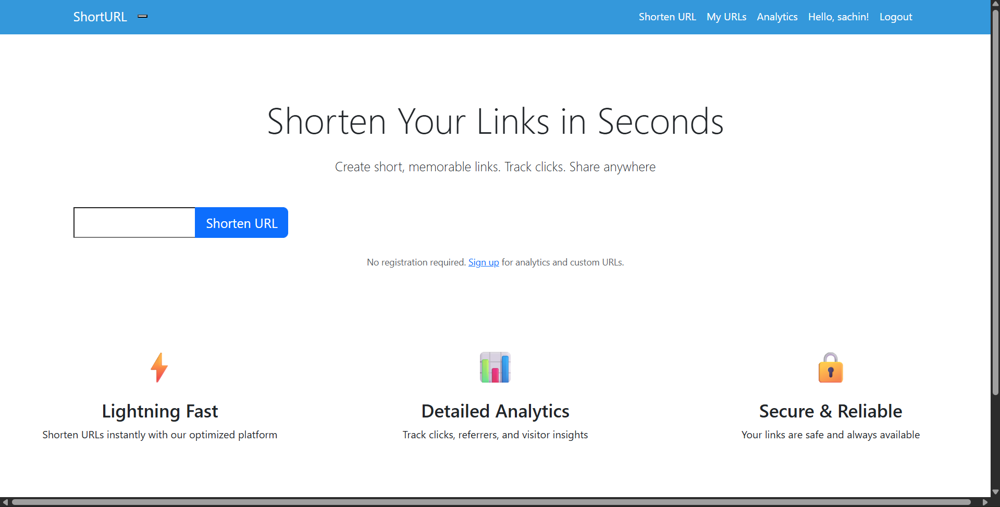
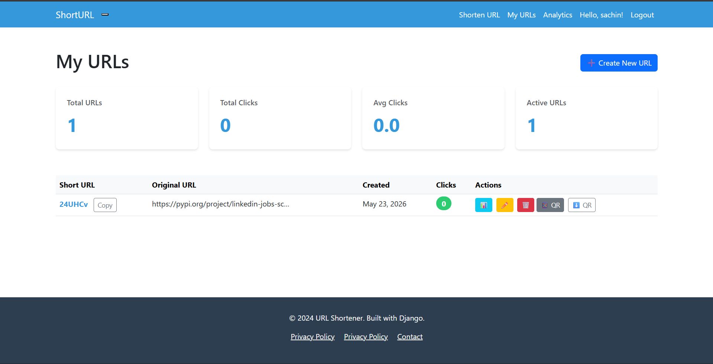

# 🚀 URL-Shortener

<div align="center">

[](https://github.com/sachinbudhamagar/URL-Shortener/stargazers)

[](https://github.com/sachinbudhamagar/URL-Shortener/network)

[](https://github.com/sachinbudhamagar/URL-Shortener/issues)

[](LICENSE)

**A robust URL shortener web application with user accounts, custom URLs, and analytics.**

</div>


## 🖥️ Screenshots

 



## 🛠️ Tech Stack

**Backend:**


**Database:**

 (for local development)

 (for Docker deployment)

**DevOps:**


## 🚀 Quick Start

### Prerequisites

-   **Python**: Version 3.9+ (as specified in Dockerfile, but usually any 3.x works)
-   **pip**: Python package installer
-   **Docker** & **Docker Compose**: For containerized setup (optional, but recommended for production-like environment)

### Installation (Local Development with SQLite)

1.  **Clone the repository**
    ```bash
    git clone https://github.com/sachinbudhamagar/URL-Shortener.git
    cd URL-Shortener
    ```

2.  **Create a virtual environment**
    ```bash
    python -m venv venv
    source venv/bin/activate  # On Windows use `venv\Scripts\activate`
    ```

3.  **Install dependencies**
    ```bash
    pip install -r requirements.txt
    ```

4.  **Database setup**
    The project uses SQLite by default for local development.
    ```bash
    python manage.py makemigrations accounts shortener analystics
    python manage.py migrate
    ```

5.  **Create a superuser** (for accessing Django admin panel)
    ```bash
    python manage.py createsuperuser
    ```
    Follow the prompts to create your superuser account.

6.  **Start development server**
    ```bash
    python manage.py runserver
    ```

7.  **Open your browser**
    Editor/bash will suggest to vist `http://0.0.0.0:8000`.
    Visit `http://localhost:8001` to access the application.

### Installation (Dockerized with PostgreSQL)

1.  **Clone the repository**
    ```bash
    git clone https://github.com/sachinbudhamagar/URL-Shortener.git
    cd URL-Shortener
    ```

2.  **Environment setup**
    Create a `.env` file in the root directory. This file will be used by `docker-compose.yml`.
    ```env
    # .env
    DJANGO_SECRET_KEY='your_strong_django_secret_key'
    DJANGO_DEBUG=True 
    DJANGO_ALLOWED_HOSTS='localhost,127.0.0.1'

    POSTGRES_NAME=urlshortener_db
    POSTGRES_USER=user
    POSTGRES_PASSWORD=password
    POSTGRES_HOST=db
    POSTGRES_PORT=5432
    ```
    *Note: The `POSTGRES_*` variables are already set in `docker-compose.yml` for the `db` service.

3.  **Build and run Docker containers**
    ```bash
    docker-compose up --build
    ```
    This command will build the Docker images (if not already built) and start the `web` and `db` services.

4.  **Apply database migrations (first time)**
    Open a new terminal and run migrations inside the web container:
    ```bash
    docker-compose exec web python manage.py makemigrations accounts shortener analystics
    docker-compose exec web python manage.py migrate
    ```

5.  **Create a superuser (first time)**
    ```bash
    docker-compose exec web python manage.py createsuperuser
    ```

6.  **Open your browser**
    Editor/bash will suggest to vist `http://0.0.0.0:8000`.
    Visit `http://localhost:8001` to access the application.

## 📁 Project Structure

```
URL-Shortener/
├── .dockerignore          
├── .vscode/                
├── Dockerfile              
├── LICENSE                 
├── README.md               
├── Screenshots/            # Directory containing project screenshots
├── accounts/               # Django app for user authentication and account management
│   ├── migrations/
│   ├── templates/accounts/
│   └── ...                
├── analystics/             # Django app for URL usage statistics and analytics
│   ├── migrations/
│   ├── templates/analystics/
│   └── ...                 
├── db.sqlite3              
├── docker-compose.yml      # Docker Compose configuration for multi-service setup (web, db)
├── manage.py              
├── media/                 
├── requirements.txt       
├── shortener/              # Django app for core URL shortening logic
│   ├── migrations/
│   ├── templates/shortener/
│   └── ...                
└── url_shortener/          # Main Django project directory
    ├── __init__.py
    ├── asgi.py
    ├── settings.py         # Project settings
    ├── urls.py             # Main URL configuration
    └── wsgi.py             # WSGI configuration for production deployment
```

## ⚙️ Configuration

### Environment Variables

The application can be configured using environment variables, especially when deployed with Docker Compose and a `.env` file.

| Variable | Description | Default | Required |
|----------|-------------|---------|----------|
| `DJANGO_SECRET_KEY` | Django secret key for cryptographic signing | (None) | Yes |
| `DJANGO_DEBUG` | Sets Django's debug mode (True/False) | `False` | No |
| `DJANGO_ALLOWED_HOSTS` | Comma-separated list of hosts this Django site can serve | `localhost` | No |
| `POSTGRES_NAME` | PostgreSQL database name | `urlshortener_db` | Yes |
| `POSTGRES_USER` | PostgreSQL database user | `user` | Yes |
| `POSTGRES_PASSWORD` | PostgreSQL database password | `password` | Yes |
| `POSTGRES_HOST` | PostgreSQL database host (e.g., `db` for Docker Compose) | `localhost` | Yes |
| `POSTGRES_PORT` | PostgreSQL database port | `5432` | Yes |

## 🔧 Development

### Available Scripts

| Command | Description |
|---------|-------------|
| `python manage.py runserver` | Starts the Django development server. |
| `python manage.py makemigrations [app_name]` | Creates new database migrations based on model changes. |
| `python manage.py migrate` | Applies database migrations. |
| `python manage.py createsuperuser` | Creates an administrative user for the Django admin. |
| `docker-compose up --build` | Builds (if needed) and starts the Docker services. |
| `docker-compose exec web python manage.py [django_command]` | Executes a Django management command inside the web container. |
| `docker-compose down` | Stops and removes Docker containers and networks. |

### Development Workflow

    1.  Make changes to the code.
    2.  If you modify models, run `python manage.py makemigrations [app_name]` followed by `python manage.py migrate`.
    3.  Restart the development server (`python manage.py runserver`) or `docker-compose up --build` #Docker.
    4.  Test your changes in the browser.

## 🚀 Deployment

The application is set up for containerized deployment using Docker.

```bash

# Build production-ready images and run services
docker-compose up --build -d # -d for detached mode
```

## 🤝 Contributing

We welcome contributions! If you'd like to contribute, please follow these steps:

      1.  Fork the repository.
      2.  Create a new branch for your feature or bug fix: `git checkout -b feature/your-feature-name`.
      3.  Make your changes and ensure they adhere to the project's coding style.
      4.  Write appropriate tests for your changes.
      5.  Commit your changes: `git commit -m 'feat: Add new feature'`.
      6.  Push to your branch: `git push origin feature/your-feature-name`.
      7.  Open a Pull Request to the `main` branch of this repository.

## 📄 License

This project is licensed under the [MIT License](LICENSE) - see the [LICENSE](LICENSE) file for details.

## 🙏 Acknowledgments

-   Built with [Django](https://www.djangoproject.com/) for a robust web framework.
-   Utilizes [PostgreSQL](https://www.postgresql.org/) for reliable data storage in production.
-   Containerized with [Docker](https://www.docker.com/) for consistent deployment.

## 📞 Support & Contact

-   🐛 Issues: [GitHub Issues](https://github.com/sachinbudhamagar/URL-Shortener/issues)
-   📧 Contact the author: [sachin.budhamagar@example.com](mailto:sachinbmagar19@gmail.com)

---

<div align="center">

**⭐ Star this repo if you find it helpful!**

Made by [sachinbudhamagar](https://github.com/sachinbudhamagar)

</div>

